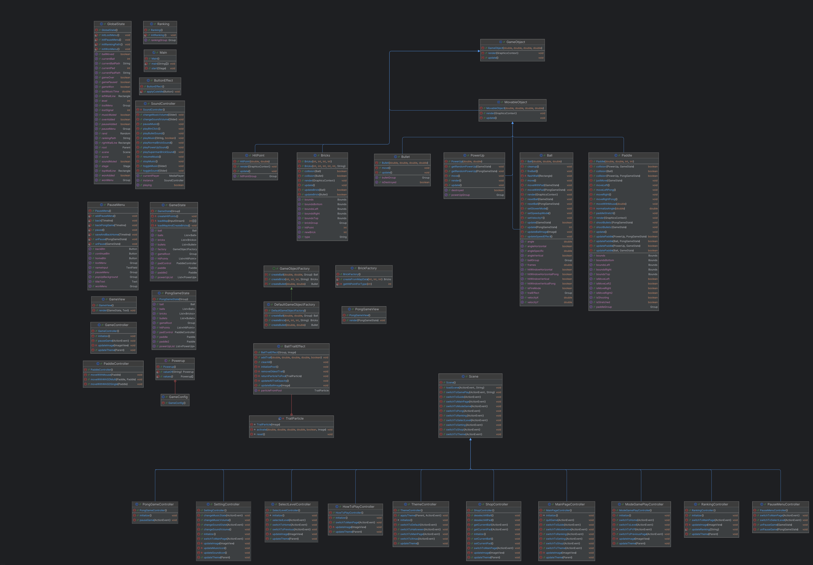

# Arkanoid Game - Object-Oriented Programming Project

## Author
**Group 1 - Class INT2204 1**
1. Lê Quốc Anh - 24020010
2. Dương Đăng Khoa - 24020181
3. Cao Anh Đức - 24020073

**Instructor**: Kiều Văn Tuyên & Vũ Đức Hiếu  
**Semester**: HK1 - 2025

---

## Description
This is a classic Arkanoid game developed in Java as a final project for Object-Oriented Programming course. The project demonstrates the implementation of OOP principles and design patterns.

**Key features:**
1. The game is developed using Java 17+ with JavaFX for GUI.
2. Implements core OOP principles: Encapsulation, Inheritance, Polymorphism, and Abstraction.
3. Applies multiple design patterns: Singleton, Factory Method, Strategy, Observer, and State.
4. Features multithreading for smooth gameplay and responsive UI.
5. Includes sound effects, animations, and power-up systems.
6. Supports save/load game functionality and leaderboard system.

**Game mechanics:**
- Control a paddle to bounce a ball and destroy bricks
- Collect power-ups for special abilities
- Progress through multiple levels with increasing difficulty
- Score points and compete on the leaderboard

---

## UML Diagram

### Class Diagram

---

## Design Patterns Implementation

### 1. MVC
**Used in:** `All project follow MVC Pattern`

**Purpose:** The MVC pattern is to separate interface, processing, and controls to make the code easier to maintain, extend, reuse, and organize more clearly.
### 2. Singleton Pattern
**Used in:** `SoundController`

**Purpose:** Ensure only one instance exists throughout the application.

### 3. Factory method
**Used in:** `BrickFactory, GameObjectFactory
**Purpose:** Create objects easier and more structurally.
### 4. Object Pool
**Used in:** `BallTrailEffect`

**Purpose:** Optimize memory for ball trail overlays.

---

## Multithreading Implementation
The game uses multiple threads to ensure smooth performance:
1. **Game Loop Thread**: Updates game logic at 100 FPS
2. **Rendering Thread**: Handles graphics rendering (EDT for JavaFX Application Thread)
3. **Audio Thread Pool**: Plays sound effects asynchronously
4. **I/O Thread**: Handles save/load operations without blocking UI

---

## Installation

1. Clone the project from the repository.
2. Open the project in the IDE.
3. Run the project.

## Usage

### Controls
| Key | Action |
|-----|--------|
| `←` or `A` | Move paddle left |
| `→` or `D` | Move paddle right |
| `SPACE` | Launch ball / Shoot laser |
| `ESC` | Pause game |

### How to Play
1. **Start the game**: Click "PLAY" from the main menu.
2. **Control the paddle**: Use arrow keys or A/D to move left and right.
3. **Launch the ball**: Press SPACE to launch the ball from the paddle.
4. **Destroy bricks**: Bounce the ball to hit and destroy bricks.
5. **Collect power-ups**: Catch falling power-ups for special abilities.
6. **Avoid losing the ball**: Keep the ball from falling below the paddle.
7. **Complete the level**: Destroy all destructible bricks to advance.

### Power-ups
| Icon | Name | Effect |
|------|------|--------|
|  | Expand Paddle | Increases paddle width for 10 seconds |
| | Fast Ball | Increases ball speed by 50% |
|  | Slow Ball | Decreases ball speed by 40% |
|  | Multi Ball | Spawns 3 additional balls |
|  | Laser Gun | Shoot lasers to destroy bricks for 6 seconds |
|  | Heart | Get 1 extra life for the level |
|  | Fire Ball | Ball passes through bricks for 12 seconds |

---

## Demo

### Screenshots

**Main Menu**  

**Gameplay**

**Settings**

**Select Theme**

**Ranking**

### Video Demo
[DEMO](https://youtu.be/YnCnFk2HQ74)
---

## Additional features

### Features
#### Select level
- We have 12 levels, each one a challenge
  

#### PVP
- You can play with your friend, the first player uses A - D , the second player uses ← , → to move. The player who lets his ball pass through the defensive zone loses
  

#### Interfaces
- There are 3 different interfaces: Christmas, Halloween, and default. When switching interfaces, all sounds and images will change creating a diverse feeling.
  
  

---

## Technologies Used

| Technology | Version | Purpose |
|------------|---------|---------|
| Java | 17+ | Core language |
| JavaFX | 19.0.2 | GUI framework |
| Maven | 3.9+ | Build tool |
| Jackson | 2.15.0 | JSON processing |

---

## References

### Image & Sprites
Design yourself

### #Background Music:

- https://www.youtube.com/watch?v=CY5u3yH8t34&list=PL6uM6_aoRG567o8w8Ago04NZF_R28c0qE&index=3
- https://www.youtube.com/watch?v=itCV2sZKRX0
- https://www.youtube.com/watch?v=-N63sX9Uq2o&list=RD-N63sX9Uq2o&start_radio=1

### SFX
- Youtube meme sound effect.

### Tutorial
- https://www.youtube.com/watch?v=9XJicRt_FaI&t=3s
- https://www.youtube.com/watch?v=FLkOX4Eez6o&list=PL6gx4Cwl9DGBzfXLWLSYVy8EbTdpGbUIG

### Supporter
Thank you teachers Kieu Van Tuyen and Vu Duc Hieu for helping us complete this project.

## License

This project is developed for educational purposes only.

**Academic Integrity:** This code is provided as a reference. Please follow your institution's academic integrity policies.

---

## Notes

- The game was developed as part of the Object-Oriented Programming with Java course curriculum.
- All code is written by group members with guidance from the instructor.
- Some assets (images, sounds) may be used for educational purposes under fair use.
- The project demonstrates practical application of OOP concepts and design patterns.

---

*Last updated: [11/11/2025]*
